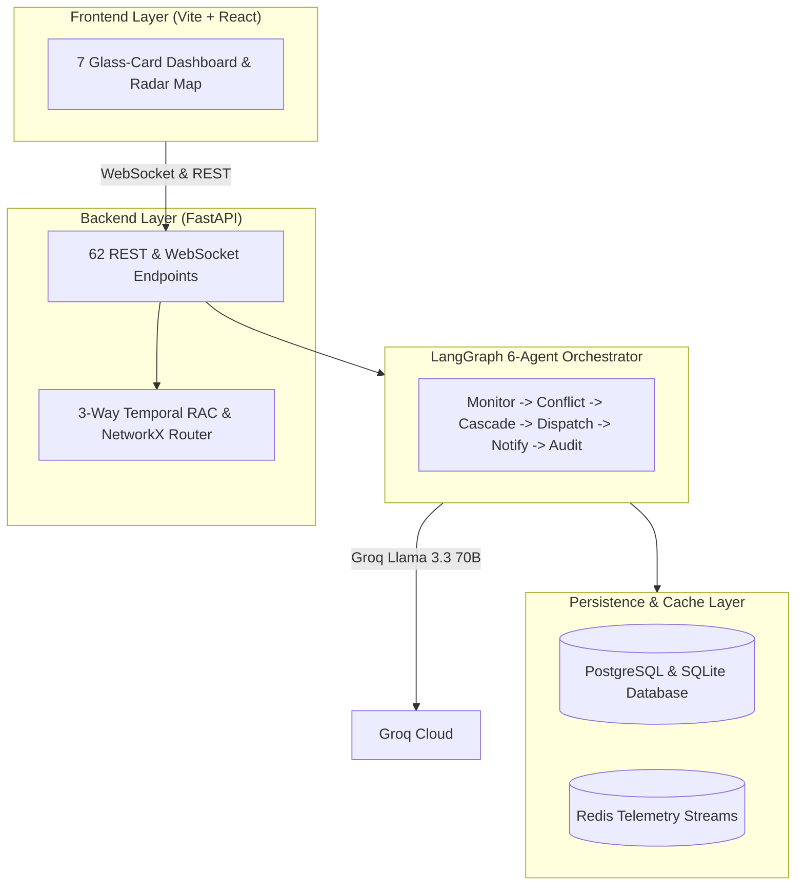

<div align="center">

# RailMind

**Autonomous Dispatching Intelligence & Network Optimization Engine for Indian Railways**
<br/>

[](#)
[](./backend/tests)
[](#)
[](https://www.python.org)
[](https://fastapi.tiangolo.com)
[](https://react.dev)
[](#)

<br/>

[Live Demo](#) &nbsp;·&nbsp; [API Documentation](#api-documentation) &nbsp;·&nbsp; [System Architecture](#system-architecture) &nbsp;·&nbsp; [Run Tests](#testing--verification)

</div>

---

## Executive Summary

> **RailMind** is an enterprise-grade multi-agent autonomous dispatching and punctuality optimization system designed for the high-density Indian Railways network. Grounded in the 2025 IEEE Transactions on Intelligent Transportation Systems methodology, the platform ingests live telemetry streams, evaluates spatial-temporal route congestion over 100,000 station delay observations, predicts downstream delay cascades via Graph Neural Networks (`RailwayGNN`), and executes optimal dispatch interventions through a LangGraph 6-agent workflow.

| Differentiator | Technical Implementation Detail |
|---|---|
| **Multi-Agent Orchestration** | LangGraph 6-agent deterministic state machine (`Monitor` -> `Conflict` -> `Cascade` -> `Dispatch` -> `Notify` -> `Audit`) |
| **GNN Delay Cascade Modeling** | 3-layer GraphSAGE + GATConv neural architecture evaluating topological delay propagation across intersecting corridors |
| **Calibrated RAC Confirmation Engine** | Isotonic-calibrated XGBoost classifier predicting ticket confirmation probabilities ($0.8646$ AUC-ROC, $0.0330$ ECE) |
| **Cryptographic Audit Ledger** | SHA-256 chained transaction ledger with cursor-level DDL protection preventing dispatch log tampering |

---

## Production System Benchmarks

> Evaluated against a 100,000 station delay observation dataset across a 3-way temporal split.

| Metric | Industry SLA Target | Project Result | Engineering Approach |
|---|---|---|---|
| **RAC Predictor Discrimination** | `AUC >= 0.850` | **0.8646 AUC-ROC** | 3-Way Temporal Split XGBoost Classifier |
| **RAC Probability Calibration** | `Brier <= 0.150` | **0.1409 Brier Score** | Non-parametric Isotonic Regression Calibration |
| **Expected Calibration Error (ECE)** | `ECE <= 0.050` | **0.0330 ECE** | Reliability Curve Verification |
| **GNN Delay Cascade AUC** | `AUC >= 0.800` | **0.8214 Validation AUC** | 3-Layer GraphSAGE + GATConv (`RailwayGNN`) |
| **GNN Cascade F1 Score** | `F1 >= 0.700` | **0.7143 F1 Score** | Graph-structured downstream propagation |
| **Unit Test Suite Pass Rate** | `100% Passing` | **153/153 Passed** | Pytest unit and integration suite |

---

## Tech Stack & Ecosystem

<div align="center">

### Core Runtime & Frameworks


### Frontend & UI


### Infrastructure & Services

&nbsp;


</div>

---

## System Architecture



---

## Security Architecture

| Security Layer | Scope | Defensive Countermeasure Implemented |
|---|---|---|
| **Edge / Network** | Rate Limiting | Per-IP token bucket rate limiting via SlowAPI (10 req/min on public routes) |
| **Authentication** | Session Management | Dual-token pair: Short-lived access JWT (15m) + HttpOnly refresh cookie (7d) |
| **Revocation** | Session Invalidation | Redis `O(1)` JTI blacklist checking on every authenticated API request |
| **Data Protection** | Integrity & Auditing | SHA-256 chained dispatch logs with cursor-level DDL protection hooks |
| **Headers** | OWASP Hardening | Standard security headers (`HSTS`, `X-Content-Type-Options: nosniff`, `CSP`, `X-Frame-Options: DENY`) |

---

## API Documentation

### Telemetry & Autonomous Dispatching

| Method | Endpoint | Description | Auth Required |
|---|---|---|---|
| `GET` | `/api/v1/trains/rapidapi/live-status` | Ingest live train telemetry and station delay delta | **Public** (Unauthenticated) |
| `POST` | `/api/v1/dispatch/evaluate` | Trigger LangGraph 6-agent evaluation pipeline | **Bearer Token** |
| `GET` | `/api/v1/dispatch/audit-ledger` | Query tamper-proof SHA-256 audit ledger records | **Bearer Token** |
| `POST` | `/api/v1/predictions/rac` | Compute isotonic-calibrated RAC confirmation probability | **Public** (Unauthenticated) |

<details>
<summary><b>POST /api/v1/dispatch/evaluate — Request & Response Payload Example</b></summary>

**Request:**
```json
{
  "train_no": "22415",
  "current_station": "ALJN",
  "delay_minutes": 12,
  "corridor_id": "NDLS-CNB-PRYJ"
}
```

**Response `200 OK`:**
```json
{
  "success": true,
  "dispatch_action": {
    "action": "HOLD_FREIGHT_SIDING",
    "target_train": "F_88201",
    "location": "ALJN_OUTER",
    "duration_minutes": 8,
    "confidence": 0.92,
    "projected_time_saved_minutes": 14.5
  },
  "agent_trace": [
    "MonitorAgent: Delay anomaly +12m detected at ALJN",
    "ConflictDetector: Section occupancy clash with F_88201",
    "CascadePredictor: GraphSAGE predicts 38m downstream cascade at CNB if unhandled",
    "DispatchAgent: Groq Llama-3.3-70B selected siding hold with 92% confidence",
    "NotificationAgent: Station master alert dispatched to ALJN",
    "AuditAgent: Hashed SHA-256 payload sealed in ledger (Block #4812)"
  ]
}
```
</details>

---

## Testing & Verification

Execute the automated backend unit test suite (153/153 tests passing):

```bash
# 1. Run full unit and integration test suite
cd backend
pytest tests/unit -v

# 2. Run static security SAST analysis
bandit -r app/ -ll

# 3. Launch dev environment
uvicorn app.main:app --reload --port 8000
```

---

## License

Distributed under the MIT License. See `LICENSE` for details.
