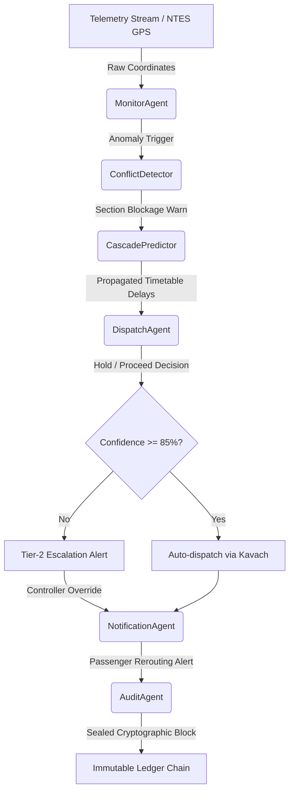
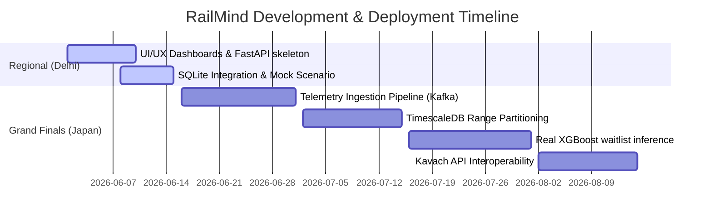

# RailMind — Autonomous Intelligence for Indian Railways

> **Round 1 Screening Submission  ·  Delhi Regional Finals  ·  Japan Grand Finals Target**  
> *Autonomous Agentic Dispatching, Predictive Delay Cascading, & Cryptographic Audit Ledger Console.*

---

## 1. Project Vision & Architecture

RailMind is an autonomous agentic decision system designed to address punctuality collapses in Indian Railways. By replacing manual, biased block control decisions with a synchronized multi-agent graph, RailMind automatically projects downstream delay cascades and formulates optimal hold-proceed dispatch resolutions.

### 1.1 Multi-Agent State Machine (LangGraph Flow)

The system operates as a state machine where execution flows sequentially, transferring context updates and validation tokens:



---

## 2. System Architecture & Components

RailMind is built as a highly decoupled, responsive full-stack system:

```
+--------------------------------------------------------------------------------+
|                             VITE REACT DASHBOARD                               |
|   +-----------------------+ +--------------------+ +-----------------------+   |
|   |   Telemetry SVG Map   | | Filtered Logs Term | | SVG Confidence Circle |   |
|   +-----------------------+ +--------------------+ +-----------------------+   |
|   +-----------------------+ +--------------------+ +-----------------------+   |
|   |  XGBoost RAC Predict  | | Ledger Verify Scan | | Step-Timeline Manager |   |
|   +-----------------------+ +--------------------+ +-----------------------+   |
+---------------------------------------+----------------------------------------+
                                        | HTTP / REST (Vite Dev Proxy)
                                        v
+--------------------------------------------------------------------------------+
|                             FASTAPI BACKEND ENGINE                             |
|   +------------------------------------------------------------------------+   |
|   |                        API V1 ROUTING ENDPOINTS                        |   |
|   |    /auth (JWT)  ·  /trains  ·  /disruptions  ·  /cascade  ·  /rac       |   |
|   +------------------------------------+-----------------------------------+   |
|                                        |
|                                        v
|   +------------------------------------------------------------------------+   |
|   |                     SCENARIO PLAYER ENGINE (Dual Mode)                 |   |
|   |      Step-Timeline (0-6)  ·  DB Sync  ·  NetworkX BFS Propagation      |   |
|   +------------------------------------+-----------------------------------+   |
|                                        |
|                                        v
|   +------------------------------------------------------------------------+   |
|   |                           PERSISTENCE LAYER                            |   |
|   |               SQLAlchemy ORM  ·  Async SQLite local DB                 |   |
|   +------------------------------------------------------------------------+   |
+--------------------------------------------------------------------------------+
```

---

## 3. High-Fidelity Presentation Scenario

To guarantee a 100% stable presentation independent of external live API servers, the dashboard integrates a **Scenario Player Engine**:

* **Step 0: Nominal Operation:** Corridor segments clear, trains within schedules.
* **Step 1: Signal Fault Ingestion:** Exit signaling fault at New Delhi Station (NDLS) traps Shatabdi Express 12002.
* **Step 2: Conflict Identification:** Path projections identify section occupancy conflicts downstream with Coal Freight BOXN-902.
* **Step 3: Timetable Cascade Simulation:** BFS delay propagation tree calculates delay transfers to Vande Bharat 22415.
* **Step 4: Hold Decision & Escalation:** Dispatch Agent recommends holding BOXN-902 at loop. Confidence (78%) < threshold (85%), triggering manual Tier-2 controller escalation.
* **Step 5: Passenger Rerouting & Advisories:** stranding warnings are broadcast to passenger panels with Vande Bharat seat confirmation probabilities (88%).
* **Step 6: Resolution:** Controller overrides/approves recommendation. Blockages clear, audit log sealed.

---

## 4. Road Map to Grand Finals (Delhi & Tokyo)



---

## 5. Setup & Execution

### 5.1 Quickstart (Unified script)

Execute the master setup script to install virtual environments, seed database nodes, install npm modules, and run verification tests automatically:

```bash
chmod +x setup.sh
./setup.sh
```

### 5.2 Starting Services

1. **Activate virtual environment & run FastAPI:**
   ```bash
   cd backend
   source .venv/bin/activate
   uvicorn app.main:app --reload --port 8000
   ```

2. **Start Vite React development client:**
   ```bash
   cd frontend
   npm run dev
   ```
   *Access the console via browser: `http://localhost:5173`.*
