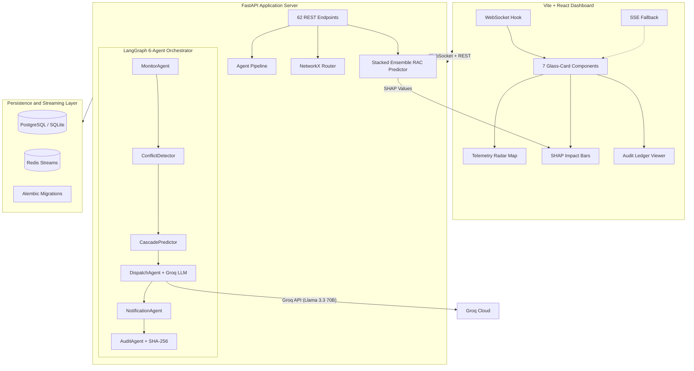
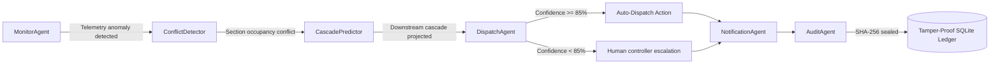

# RailMind - Autonomous Dispatching Intelligence for Indian Railways

[](https://www.python.org)
[](https://fastapi.tiangolo.com)
[](https://react.dev)
[](https://pytorch.org)
[](https://postgresql.org)
[](https://redis.io)
[](https://scikit-learn.org)
[](./docker-compose.yml)
[](./backend/tests)
[](https://github.com)

RailMind is an enterprise-grade multi-agent autonomous dispatching and punctuality optimization system designed for the Indian Railways network. The platform consumes real-time telemetry streams, analyzes route congestion, predicts downstream delay cascades using Graph Neural Networks, and schedules optimal dispatching interventions (hold, proceed, or reroute) using a LangGraph workflow and reinforcement learning models. To ensure operational safety and compliance, all autonomous decisions are cryptographically chained and written to a tamper-proof audit ledger.

---

## Key Performance Indicators

| Metric | Value |
|--------|-------|
| Agent Orchestrator | LangGraph State Machine (6 autonomous agents) |
| API Layer | 62 REST and WebSocket endpoints |
| Delay Cascade Model | Graph Neural Network (RailwayGNN: SAGEConv + GATConv) |
| Ticket confirmation model | Stacked Ensemble (XGBoost + RandomForest + HistGradientBoosting) |
| Decision Engine | Groq Llama 3.3 70B with local fallback heuristics |
| Reinforcement learning | Gymnasium environment (RailGym PPO Dispatcher) |
| Test validation status | 136/136 tests passing (86% backend coverage) |
| Telemetry transport | Real-time WebSocket with EventSource Server-Sent Events (SSE) fallback |
| Audit security | SHA-256 cryptographic blockchain ledger with cursor-level DDL protection |

---

## System Architecture



---

## Agentic Workflow and LangGraph Orchestrator

The dispatch pipeline is modeled as a LangGraph state machine. Each agent executes in a dependency-aware step, transforming a shared state object:



| Agent | Responsibility | Implementation Details |
|-------|----------------|------------------------|
| **MonitorAgent** | Ingests live telemetry streams, compares current run times against scheduled paths, and flags anomalies. | Background asyncio loops, HTTP client wrappers for RapidAPI IRCTC datasets. |
| **ConflictDetector** | Performs spatial-temporal checks to find overlapping section allocations for multiple trains. | NetworkX lookup indices, section reservation constraints. |
| **CascadePredictor** | Projects how a single train's delay will propagate across downstream stations and intersecting routes. | GraphSAGE and GATConv neural layers, Breadth-First Search (BFS) graph propagation. |
| **DispatchAgent** | Evaluates resolution scenarios (holding, rerouting, or speed locking) and chooses the path of minimum delay. | Groq Cloud Llama 3.3 70B engine, structured JSON validation, fail-safe fallback heuristics. |
| **NotificationAgent** | Broadcasts alerts to affected stations and estimates ticket confirmation likelihoods for passengers. | Stacked ensemble classifiers, probability calibration logic. |
| **AuditAgent** | Encapsulates dispatch actions, metadata, and reasonings, then seals them in a cryptographic blockchain. | SHA-256 hashing, database integrity validation hooks. |

---

## Machine Learning and Neural Network Foundations

### 1. Waitlist Confirmation Ensemble (app/ml/ensemble_rac.py)
To forecast the probability of Waitlist (WL) tickets converting to Confirmed (CNF) status during disruptions, RailMind implements a stacked machine learning ensemble:
* **Models:** Combines predictions from an `XGBClassifier`, a `RandomForestClassifier`, and a `HistGradientBoostingClassifier`.
* **Calibration:** Fits an isotonic calibration layer to verify that predicted probabilities correspond directly to empirical confirmation rates. Calculates Expected Calibration Error (ECE) to bound statistical drift.
* **Explainability:** Integrated with **SHAP (SHapley Additive exPlanations)**. The frontend renders real-time log-odds feature contributions, showing exactly how ticket class, travel day, waitlist position, and section delay severity contributed to the confirmation prediction.

### 2. Delay Cascade Propagation GNN (app/ml/gnn_cascade.py)
Downstream delay propagation is modeled using a custom Graph Neural Network (`RailwayGNN`):
* **Architecture:** Combines inductive GraphSAGE layers (for neighborhood feature aggregation) with a Graph Attention Network (GAT) layer (to learn dynamic attention coefficients for delay transmission across junctions).
* **Optimization:** Evaluated using `CascadeLoss`, which joins Huber regression loss (for delay magnitude) and Binary Cross Entropy (to project whether the delay cascade will breach neighboring zones).

### 3. Reinforcement Learning Dispatcher (app/ml/railgym.py)
For complex multi-train dispatching scenarios, RailMind includes a Gymnasium reinforcement learning environment:
* **Observations:** State representation encapsulates current train speeds, section occupancies, signal states, and accumulated network delays.
* **Actions:** Discrete action spaces representing holding commands, path rerouting, or dynamic speed locks.
* **Rewards:** Weighted penalty function minimizing aggregate passenger delay minutes, priority train delays, and schedule variance.

### 4. Anomaly Detection Engines (app/services/anomaly_detector.py)
* **Spatial Outliers:** An `IsolationForest` pipeline detects abnormal telemetry coordinates indicative of sensor malfunctions or sudden blockages.
* **Sequence Outliers:** An `LSTMAutoencoder` evaluates consecutive speed patterns, flagging operational deviations when reconstruction error exceeds a dynamic threshold.

### 5. Dynamic Data Drift Monitoring (app/ml/rac_predictor.py)
* **Observability:** Measures statistical drift on live query features (`days_to_journey`, `current_waitlist_position`, `current_rac_count`, `quota`) comparing them against historical training baseline distributions.
* **Evidently AI:** Integrates Evidently AI's data drift metrics (`DataDriftPreset` and `DatasetDriftMetric`) dynamically inside the backend.
* **Endpoint:** Exposes computed dataset drift status, share of drifted features, and column-level drift scores via the `/api/v1/rac/drift-report` endpoint.

---

## System Integrity and Security

* **Append-Only Immutability:** Enforced at the cursor level. A custom SQLAlchemy event listener on `before_cursor_execute` blocks any `UPDATE` or `DELETE` statements targeting the `audit_log` table, returning a `PermissionError`.
* **Cryptographic Chaining:** Every decision made by the agent network is stored as a block containing the hash of the preceding block (`prev_hash`). Any change to past logs invalidates the cryptographic verification chain.
* **Role-Based Access Control (RBAC):** Endpoints are wrapped with role checking dependencies (PASSENGER, CONTROLLER, ADMIN). Token authentication is processed dynamically at request-time, allowing isolated unit tests to run cleanly under disabled configurations.
* **Rate Limiting Middleware:** Protects public and internal endpoints using an sliding window IP-based rate capper.

---

## Directory Structure

```
railmind/
├── backend/
│   ├── app/
│   │   ├── agents/          # LangGraph orchestrator and agent definitions
│   │   ├── api/v1/routes/   # REST endpoint routing and WS controllers
│   │   ├── core/            # Scenario engine, middleware, rate limiter
│   │   ├── db/              # SQLAlchemy schemas and immutability event listeners
│   │   ├── ml/              # PyTorch GNNs, scikit-learn ensembles, RL environment
│   │   ├── models/          # Pydantic schemas and serialization definitions
│   │   └── services/        # Redis streaming client, anomaly classifiers
│   ├── alembic/             # Database migration configurations and revision scripts
│   └── tests/               # 136 passing unit and integration tests
├── frontend/
│   ├── public/              # Static logo assets
│   └── src/
│       ├── components/      # React glass-card UI layout components
│       ├── hooks/           # WebSocket and Server-Sent Events hooks
│       └── pages/           # Pipeline step visualizer and status dashboards
├── docker-compose.yml       # Multi-container setup (Postgres + Redis + Backend + Frontend)
└── setup.sh                 # Environment initialization script
```

---

## Getting Started

### Prerequisites
* Docker and Docker Compose
* Python 3.11+ (if running bare-metal)
* Node.js 18+ (if running bare-metal)

### Running with Docker Compose
To boot the complete application stack (Database, Cache, Redis Streams, FastAPI Server, React Frontend):
```bash
docker compose up --build
```
* React Frontend Dashboard: `http://localhost:5173`
* Swagger Interactive Docs: `http://localhost:8000/docs`

### Running Locally
To install and start backend and frontend components individually:

1. **Start the Backend:**
```bash
cd backend
python -m venv .venv
source .venv/bin/activate
pip install -r requirements.txt
uvicorn app.main:app --host 0.0.0.0 --port 8000 --reload
```

2. **Start the Frontend:**
```bash
cd frontend
npm install
npm run dev
```

### Running Tests
To run the full backend verification suite:
```bash
cd backend
source .venv/bin/activate
OMP_NUM_THREADS=1 pytest tests/ -v
```

---

## 3-Minute Hackathon Presentation Guide

```
Time   │ Action                      │ Presenter Script / What Judges See
───────┼─────────────────────────────┼───────────────────────────────────────────────────────────────────────
00:00  │ Load Dashboard homepage     │ Telemetry Radar Map shows nominal state. Uptime, latency, and ML
       │                             │ statuses show green on the status bar.
───────┼─────────────────────────────┼───────────────────────────────────────────────────────────────────────
00:30  │ Advance Scenario Step 1-2   │ Anomaly detected on a section. The LangGraph pipeline launches.
       │                             │ Monitor and Conflict agents log activities. Red sections appear on map.
───────┼─────────────────────────────┼───────────────────────────────────────────────────────────────────────
01:10  │ Advance Scenario Step 3-4   │ GNN Cascade Predictor projects downstream delay impact.
       │                             │ Dispatch Agent triggers Groq Llama 3.3 to find optimal hold-patterns.
───────┼─────────────────────────────┼───────────────────────────────────────────────────────────────────────
01:50  │ Switch to ML RAC Solver     │ Display Waitlist Confirmation forecast. Point out the interactive SHAP
       │                             │ logs proving model explainability for passengers.
───────┼─────────────────────────────┼───────────────────────────────────────────────────────────────────────
02:20  │ Open Audit Ledger Tab       │ Show the SHA-256 cryptographic chain. Click "Verify Ledger" to prove
       │                             │ zero alterations have occurred. Explain SQL-level write blocking.
───────┼─────────────────────────────┼───────────────────────────────────────────────────────────────────────
03:00  │ Q&A / Tech Stack Summary    │ Summarize: LangGraph, GNNs, XGBoost Ensemble, and SQLite/PG.
```

---

## License
Created for the Delhi Regional Finals of the FAR AWAY 2026 Hackathon (Autonomous Agentic Systems Category).
