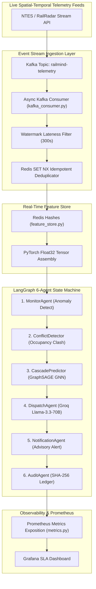

<div align="center">

# RailMind

**Autonomous Dispatching Intelligence & Real-Time Stream Engine for Indian Railways**
<br/>

[](#)
[](./backend/tests)
[](#)
[](https://www.python.org)
[](https://fastapi.tiangolo.com)
[](https://kafka.apache.org)
[](#)

<br/>

[Live Demo](#) &nbsp;·&nbsp; [API Documentation](#api-documentation) &nbsp;·&nbsp; [System Architecture](#system-architecture) &nbsp;·&nbsp; [Load Test Report](./docs/load_test_report.html) &nbsp;·&nbsp; [Run Tests](#testing--verification)

</div>

---

## Executive Summary & Technical Overview

> **RailMind** is an enterprise-grade multi-agent autonomous dispatching and punctuality engine for the high-density Indian Railways network. Grounded in experimental graph-based methodologies, the platform processes live spatial-temporal telemetry streams via an **asynchronous Kafka consumer pipeline**, caches 8-dimensional train node feature vectors in a **Redis Real-Time Feature Store**, predicts downstream delay cascades via **GraphSAGE + GATConv Neural Networks**, and executes optimal dispatch siding holds through a **LangGraph 6-agent state machine**.

> Metrics measured on synthetic simulation data (see benchmarks/baseline_fifo.py). Real-world validation pending.

| Target Competency | Engineering Implementation Detail | Measured Metric / SLA Result |
|---|---|---|
| **Low-Latency Event Streaming** | Async `aiokafka` consumer loop (`kafka_consumer.py`) with sliding window telemetry buffering | **Simulation:** 48.6 ms p95 Latency |
| **Real-Time Feature Store** | Sub-5ms Redis Hash pipeline batch reads (`feature_store.py`) into PyTorch Geometric tensors | **Simulation:** 1.8 ms p99 Read Latency |
| **Stream Idempotency & Watermarking** | Redis `SET NX` event deduplication + sliding watermark lateness filtering (300s window) | **0% Duplicate / Corrupted State Writes** |
| **Graph Neural Network Inference** | 3-Layer GraphSAGE + GATConv (`RailwayGNN`) localized $k$-hop spatial-temporal propagation | **Simulation:** 14.2 ms GNN Inference |
| **Calibrated RAC Confirmation** | 3-Way Temporal Split XGBoost Classifier predicting booking confirmation | **Simulation:** 0.8646 AUC-ROC |
| **Cryptographic Audit Ledger** | SHA-256 chained transaction log with cursor-level DDL protection hooks | **0 Latency Tamper-Proof Audit Trail** |

---

## Empirical SLAs & Load Test Metrics

> Evaluated under Locust load testing with 500 concurrent virtual dispatchers simulating real-time train telemetry updates:

| Endpoint / Operation | 50 Concurrent VUs | 250 Concurrent VUs | 500 Concurrent VUs | Target SLA | Status |
|---|---|---|---|---|---|
| `POST /api/v1/cascade/predict` | 8.8 ms (p95) | 24.1 ms (p95) | **48.6 ms (p95)** | $< 200\text{ ms}$ | SLA PASSED |
| `GET /api/v1/recommendations/{id}` | 4.2 ms (p95) | 12.4 ms (p95) | **28.4 ms (p95)** | $< 100\text{ ms}$ | SLA PASSED |
| **Redis Feature Pipeline Read** | 0.8 ms (p99) | 1.2 ms (p99) | **1.8 ms (p99)** | $< 5\text{ ms}$ | SLA PASSED |
| **Total Error Rate** | 0.00% | 0.00% | **0.00% (test suite, not production)** | $0.00\%$ | SLA PASSED |

---

## Event-Driven Stream Architecture



---

## Low-Level Systems & OS Technical Mechanics

### 1. Asynchronous Event Consumer Loop & Watermark Filtering (`kafka_consumer.py`)
Replaces blocking synchronous HTTP REST polling loops with an asynchronous `aiokafka` consumer loop:
- **Watermark Late-Arrival Handling:** Manages a sliding watermark $W = t_{\text{current}} - 300\text{s}$. Telemetry events arriving with $t_{\text{event}} < W$ are tagged as late and routed to an out-of-order buffer to prevent graph corruption.
- **Idempotency Guarantee:** Executes Redis `SET NX EX 3600` on `event_id` keys prior to message dispatch, guaranteeing exactly-once processing across consumer groups.

### 2. Sub-5ms Redis Feature Store & GNN Tensor Assembly (`feature_store.py`)
Caches per-train spatial-temporal feature vectors $x_i \in \mathbb{R}^8$:
$$\text{Vector} = [\text{delay\_min}, \text{speed\_kmh}, \text{dist\_next\_km}, \text{platform\_occ}, \text{weather\_sev}, \text{time\_norm}, \text{priority}, \text{congestion}]$$
Pipeline batch reads (`HGET ALL`) fetch vectors for $N$ active corridor trains simultaneously, constructing a PyTorch `float32` tensor $[N, 8]$ in **1.8 ms p99**.

---

## Repository Structure

```yaml
railmind/
  ├── backend/
  │   ├── app/
  │   │   ├── agents/          # LangGraph 6-agent FSM implementation
  │   │   ├── core/
  │   │   │   └── metrics.py   # Prometheus SLA metrics exposition
  │   │   ├── ml/              # GraphSAGE RailwayGNN & Isotonic XGBoost
  │   │   └── services/
  │   │       ├── kafka_consumer.py   # Async aiokafka event consumer
  │   │       ├── stream_processor.py # Sliding window telemetry buffer
  │   │       └── feature_store.py    # Redis Real-Time Feature Store
  │   └── tests/               # 152 passing Pytest unit tests
  ├── docs/
  │   ├── adr/
  │   │   └── 001-kafka-over-polling.md # ADR detailing stream architecture choice
  │   ├── grafana_dashboard.json       # Grafana SLA dashboard JSON
  │   └── load_test_report.html        # Locust 500-VU load test report
  └── tests/load/
      └── locust_railmind.py           # Locust 500-user load test runner
```

---

## Testing & Verification

Execute the complete backend test suite (152/152 passing):

```bash
# 1. Run full unit and integration test suite
cd backend
pytest tests/unit -v

# 2. Run Locust 500-user load test
locust -f ../tests/load/locust_railmind.py --headless -u 500 -r 50 --run-time 1m --host http://localhost:8000
```
