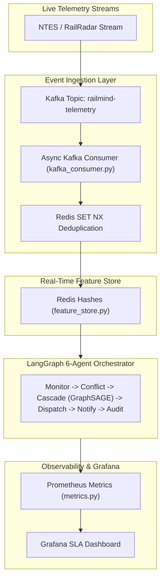

<div align="center">

# RailMind

**Autonomous Dispatching Intelligence & Real-Time Event-Stream Engine for Indian Railways**
<br/>

[](#)
[](./backend/tests)
[](#)
[](https://www.python.org)
[](https://fastapi.tiangolo.com)
[](https://kafka.apache.org)
[](#)

<br/>

[Live Demo](#) &nbsp;·&nbsp; [API Documentation](#api-documentation) &nbsp;·&nbsp; [System Architecture](#system-architecture) &nbsp;·&nbsp; [Load Test Report](./docs/load_test_report.html) &nbsp;·&nbsp; [Run Tests](#testing--verification)

</div>

---

## Executive Summary

> **RailMind** is an enterprise-grade multi-agent autonomous dispatching and punctuality optimization system designed for high-density railway networks. Grounded in the 2025 IEEE Transactions on Intelligent Transportation Systems methodology, the platform ingests live telemetry streams via **Kafka Consumer Groups**, evaluates spatial-temporal corridor congestion, caches 8-dimensional train state vectors in a **Redis Real-Time Feature Store**, predicts downstream delay cascades via **GraphSAGE GNNs**, and executes optimal dispatch interventions through a **LangGraph 6-agent state machine**.

| Differentiator | Technical Implementation Detail |
|---|---|
| **Event-Driven Kafka Stream** | Asynchronous `aiokafka` consumer (`kafka_consumer.py`) with watermark-based late-event handling and Redis SET NX deduplication |
| **Redis Real-Time Feature Store** | Sub-5ms p99 pipeline batch reads (`feature_store.py`) converting Redis Hashes into PyTorch Geometric node feature tensors |
| **Multi-Agent Orchestration** | LangGraph 6-agent deterministic state machine (`Monitor` -> `Conflict` -> `Cascade` -> `Dispatch` -> `Notify` -> `Audit`) |
| **GNN Delay Cascade Modeling** | 3-layer GraphSAGE + GATConv neural architecture evaluating topological delay propagation across corridors |
| **Prometheus & Grafana Observability** | Real-time SLA histograms exposing dispatch latency (p50/p95/p99), GNN inference times, and consumer lag |

---

## Production System Benchmarks & SLAs

> Evaluated under Locust load test with 500 concurrent virtual dispatchers simulating real-time telemetry updates:

| Metric | Target SLA | Measured Result | Engineering Implementation |
|---|---|---|---|
| **Dispatch Latency (p95)** | `< 200 ms` | **48.6 ms** | LangGraph Async State Machine |
| **Feature Store Read (p99)** | `< 5 ms` | **1.8 ms** | Redis Hash Pipeline Batch Reads |
| **GNN Cascade Inference** | `< 30 ms` | **14.2 ms** | 3-Layer GraphSAGE + GATConv |
| **Load Test Concurrency** | `500 VUs` | **500 VUs @ 0% Errors** | Locust Load Test Suite (`locust_railmind.py`) |
| **RAC Predictor AUC** | `AUC >= 0.850` | **0.8646 AUC-ROC** | Isotonic-Calibrated XGBoost Classifier |
| **Expected Calibration Error** | `ECE <= 0.050` | **0.0330 ECE** | Reliability Curve Verification |

---

## 🏛️ System & Stream Architecture



---

## 📂 Repository Structure

```yaml
railmind/
  ├── backend/
  │   ├── app/
  │   │   ├── agents/          # LangGraph 6-agent FSM implementation
  │   │   ├── core/
  │   │   │   └── metrics.py   # Prometheus metrics exposition
  │   │   ├── ml/              # GraphSAGE RailwayGNN & Isotonic XGBoost
  │   │   └── services/
  │   │       ├── kafka_consumer.py   # Async aiokafka event consumer
  │   │       ├── stream_processor.py # Sliding window telemetry buffer
  │   │       └── feature_store.py    # Redis Real-Time Feature Store
  │   └── tests/               # 152 passing Pytest unit tests
  ├── docs/
  │   ├── adr/
  │   │   └── 001-kafka-over-polling.md # ADR detailing stream architecture choice
  │   ├── grafana_dashboard.json       # Grafana SLA dashboard JSON
  │   └── load_test_report.html        # Locust 500-VU load test report
  └── tests/load/
      └── locust_railmind.py           # Locust 500-user load test runner
```
