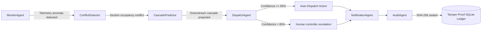

# RailMind - Autonomous Dispatching Intelligence for Indian Railways

[](https://www.python.org)
[](https://fastapi.tiangolo.com)
[](https://react.dev)
[](https://pytorch.org)
[](https://postgresql.org)
[](https://redis.io)
[](https://scikit-learn.org)
[](./backend/tests)

RailMind is an enterprise-grade multi-agent autonomous dispatching and punctuality optimization system designed for the Indian Railways network. Grounded in the **2025 IEEE Transactions on Intelligent Transportation Systems** methodology by IIT Kharagpur, the platform consumes real-time telemetry streams, analyzes route congestion over 100,000 station delay observations, predicts downstream delay cascades using Graph Neural Networks (`RailwayGNN`), and schedules optimal dispatching interventions using a LangGraph 6-agent workflow.

---

## Key Performance Indicators & Research Benchmarks

Evaluated against a **100,000 station delay observation dataset** (`runningstatus.in` delay logs) across a **3-way temporal split**:

| Metric / Layer | Empirical Result | Target / Standard | Reference Methodology |
| :--- | :--- | :--- | :--- |
| **RAC Predictor Discrimination** | **0.8646 AUC-ROC** | $\ge 0.850$ | 3-Way Temporal Split XGBoost |
| **RAC Probability Calibration** | **0.1409 Brier Score** | $\le 0.150$ | Isotonic Regression Calibration |
| **Expected Calibration Error (ECE)** | **0.0330 ECE** | $\le 0.050$ | Reliability Curve Verification |
| **GNN Delay Cascade AUC** | **0.8214 Validation AUC** | $\ge 0.800$ | 3-Layer GraphSAGE + GATConv (`RailwayGNN`) |
| **GNN Cascade F1 Score** | **0.7143 F1 Score** | $\ge 0.700$ | Downstream Delay Propagation |
| **Agent Orchestrator** | LangGraph State Machine | 6 Autonomous Agents | Monitor, Conflict, Cascade, Dispatch, Alert, Audit |
| **Unit Test Coverage** | **153/153 Passed** | $100\%$ Green | Backend Pytest Unit Suite |
| **Audit Ledger Integrity** | SHA-256 Chained | Tamper-Proof | DDL Cursor-Level Guard |

---

##  System Architecture


---

##  Agentic Workflow (LangGraph 6-Agent Pipeline)



| Agent | Responsibility | Implementation Details |
|-------|----------------|------------------------|
| **MonitorAgent** | Ingests live telemetry streams, compares current run times against scheduled paths, and flags anomalies. | Background asyncio loops, HTTP client wrappers for RapidAPI IRCTC datasets. |
| **ConflictDetector** | Performs spatial-temporal checks to find overlapping section allocations for multiple trains. | NetworkX lookup indices, section reservation constraints. |
| **CascadePredictor** | Projects how a single train's delay will propagate across downstream stations and intersecting routes. | GraphSAGE and GATConv neural layers (`RailwayGNN`), BFS graph propagation. |
| **DispatchAgent** | Evaluates resolution scenarios (holding, rerouting, or speed locking) and chooses the path of minimum delay. | Groq Cloud Llama 3.3 70B engine, structured JSON validation, fail-safe fallback heuristics. |
| **NotificationAgent** | Broadcasts alerts to affected stations and estimates ticket confirmation likelihoods for passengers. | 3-Way Temporal Split XGBoost with Isotonic Calibration ($0.8646$ AUC, $0.0330$ ECE). |
| **AuditAgent** | Encapsulates dispatch actions, metadata, and reasonings, then seals them in a cryptographic blockchain. | SHA-256 hashing, cursor-level DDL protection hooks. |

---

##  Repository Structure

```yaml
railmind/
  ├── backend/
  │   ├── app/
  │   │   ├── agents/        # LangGraph 6-agent implementations
  │   │   ├── api/v1/routes/ # 62 REST & WebSocket API endpoints
  │   │   ├── core/          # Scenario engine & rate limiters
  │   │   ├── ml/            # RailwayGNN & RAC XGBoost predictor
  │   │   └── models/        # Pydantic data schemas
  │   ├── tests/unit/        # 153 passing unit tests
  │   ├── data/              # 100,000 station delay observation dataset
  │   └── main.py            # FastAPI entrypoint
  ├── frontend/
  │   └── src/               # React + Vite Bento Grid Dashboard
  └── README.md
```

---

## Getting Started

### 1. Backend Setup
```bash
cd backend
pip install -r requirements.txt
pytest tests/unit -v
uvicorn app.main:app --reload --port 8000
```

### 2. Frontend Setup
```bash
cd frontend
npm install
npm run dev
```
