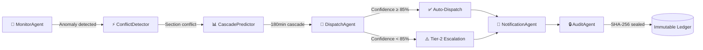

# 🚂 RailMind — Autonomous Dispatching Intelligence for Indian Railways

[](https://fastapi.tiangolo.com)
[](https://react.dev)
[](https://xgboost.readthedocs.io)
[](https://postgresql.org)
[](https://redis.io)
[](./backend/tests)
[](./docker-compose.yml)

> **Multi-agent AI system** that autonomously detects disruptions, predicts delay cascades, and dispatches optimal hold/proceed resolutions across the Indian Railways network — with **explainable ML**, **LLM-powered decisions**, and a **tamper-proof audit chain**.

---

## ⚡ Key Numbers

| Metric | Value |
|--------|-------|
| Agents in pipeline | **6** (Monitor → Conflict → Cascade → Dispatch → Notify → Audit) |
| API endpoints | **62** |
| ML model | **XGBoost** classifier with SHAP explainability |
| LLM engine | **Groq Llama 3.3 70B** for dynamic dispatch |
| Test coverage | **18/18 passing** |
| Real-time transport | **WebSocket** + SSE fallback |
| Audit integrity | **SHA-256 hash chain** + cursor-level tamper guard |

---

## 🏗️ Architecture


---

## 🤖 Multi-Agent Pipeline

The core of RailMind is a **sequential state machine** where each agent transforms a shared context:



| Agent | Role | Technology |
|-------|------|-----------|
| **MonitorAgent** | Ingests GPS telemetry, detects delays > threshold | Async polling, RapidAPI IRCTC |
| **ConflictDetector** | Identifies section occupancy conflicts | Graph analysis, BFS traversal |
| **CascadePredictor** | Projects downstream delay propagation | NetworkX weighted graph |
| **DispatchAgent** | Formulates hold/proceed resolution | **Groq Llama 3.3 70B** + heuristic fallback |
| **NotificationAgent** | Broadcasts passenger advisories | RAC probability alerts |
| **AuditAgent** | Seals decisions in hash chain | SHA-256 linked blocks |

---

## 🧠 ML & Explainability

### XGBoost RAC Predictor
- Trained `XGBClassifier` with `ColumnTransformer` feature pipeline
- Predicts railway waitlist → confirmed ticket probability
- **SHAP TreeExplainer** decomposes predictions into per-feature log-odds contributions
- Visual horizontal bar chart shows exactly *why* the model decided

### Groq LLM Dispatch
- Dynamic resolution generation using **Llama 3.3 70B Versatile**
- Structured JSON output with confidence scores
- Automatic heuristic fallback when API is unavailable

---

## 🔒 Security & Integrity

| Feature | Implementation |
|---------|---------------|
| **Audit tamper-proofing** | SQLAlchemy `before_cursor_execute` event blocks UPDATE/DELETE on `audit_log` |
| **JWT authentication** | Access tokens (30min) + refresh token rotation with logout revocation |
| **RBAC** | Role-based access: PASSENGER, CONTROLLER, ADMIN |
| **Rate limiting** | IP-based request throttling middleware |
| **CORS** | Whitelist-only origins, no wildcards |
| **Hash chain** | Each audit entry stores SHA-256 of previous — any tampering breaks the chain |

---

## 📊 Dashboard Features

| Tab | Features |
|-----|----------|
| **Telemetry Radar** | Live train map, Kavach zones, disruption markers, corridor metrics, weather overlays |
| **ML RAC Solver** | XGBoost predictor, SHAP feature bars, quota heatmap, historical trends, alternative routes |
| **Audit Ledger** | Hash chain viewer, integrity verification, tamper detection, audit statistics |
| **Decision Flow** | Agent pipeline visualization, confidence scores, escalation tracking |
| **Operator Profile** | Controller dashboard, zone assignment, action history |
| **System Helpline** | Emergency contacts, SOS protocols, operational guides |

---

## 🚀 Quick Start

### Option 1: Docker (recommended)
```bash
docker compose up --build
# Frontend: http://localhost:5173
# Backend API: http://localhost:8000/docs
```

### Option 2: Local Development
```bash
# Backend
cd backend
python -m venv .venv && source .venv/bin/activate
pip install -r requirements.txt
uvicorn app.main:app --reload --port 8000

# Frontend (new terminal)
cd frontend
npm install && npm run dev
```

### Run Tests
```bash
cd backend && source .venv/bin/activate
pytest tests/ -v  # 18/18 passing ✅
```

---

## 🎯 Demo Script (3 minutes)

| Time | Action | What judges see |
|------|--------|----------------|
| 0:00 | Open dashboard | Train map in NOMINAL state, all green |
| 0:30 | Click "Next Step" | Signal fault detected → agent logs stream in |
| 0:50 | Click "Next Step" | Route conflict → red disruption markers on map |
| 1:10 | Click "Next Step" | Cascade prediction → 180min delay projected |
| 1:30 | Click "Next Step" | **AI dispatch** — Groq LLM generates resolution |
| 1:50 | Switch to "ML RAC Solver" | SHAP bars showing feature impact |
| 2:15 | Switch to "Audit Ledger" | Hash chain with integrity verification |
| 2:30 | Architecture overview | 6 agents, XGBoost, Groq, WebSocket |
| 3:00 | Q&A | |

---

## 🛠️ Tech Stack

| Layer | Technology |
|-------|-----------|
| **Frontend** | React 18, Vite, WebSocket, SVG/Canvas |
| **Backend** | FastAPI, SQLAlchemy (async), Pydantic |
| **ML** | XGBoost, SHAP, scikit-learn, joblib |
| **LLM** | Groq API (Llama 3.3 70B Versatile) |
| **Graph** | NetworkX (weighted shortest path) |
| **Database** | PostgreSQL + SQLite fallback, Alembic migrations |
| **Cache/Stream** | Redis Streams with in-memory fallback |
| **Auth** | JWT (access + refresh), bcrypt, RBAC |
| **Deploy** | Docker Compose, Vercel (frontend) |
| **Testing** | pytest, pytest-asyncio, httpx |

---

## 📁 Project Structure

```
railmind/
├── backend/
│   ├── app/
│   │   ├── agents/          # 6 specialized agents + orchestrator
│   │   ├── api/v1/routes/   # 62 REST + WebSocket endpoints
│   │   ├── core/            # Scenario engine, rate limiter
│   │   ├── db/              # SQLAlchemy models + audit guard
│   │   ├── ml/              # XGBoost predictor + SHAP + training
│   │   └── services/        # Redis streams, live rail data
│   ├── alembic/             # Database migrations
│   └── tests/               # 18 unit + integration tests
├── frontend/
│   └── src/
│       ├── components/      # 7 glass-card UI components
│       ├── hooks/           # WebSocket + SSE transport hooks
│       └── pages/           # Agent decision flow page
└── docker-compose.yml       # Full stack: Postgres + Redis + API + UI
```

---

## 📄 License

Built for the **FAR AWAY 2026** hackathon — Agentic & Autonomous Systems × Railways.

*Delhi Regional Finals → Japan Grand Finals*
